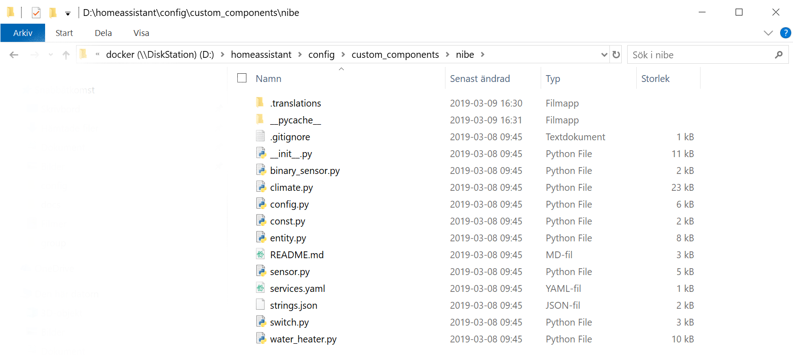
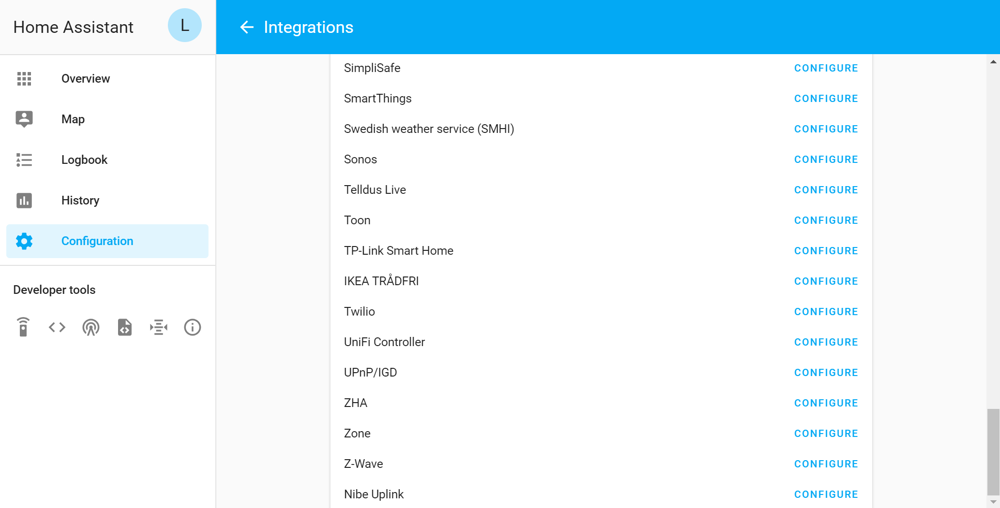
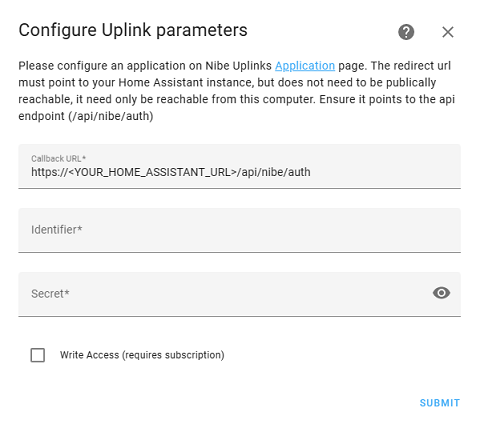
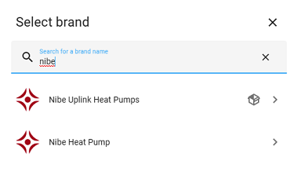

# Nibe - An home assistant plugin to get data from Nibe Uplink

## Preparation

- Register an nibe uplink application on: https://api.nibeuplink.com/
- Set the redirect url to match `<http or https>://<your_home_assistant_url_or_local_ip>:<port>/api/nibe/auth`. This is your **Callback url**
- Take note of the **Callback url**, **Identifer** (client_id) and the **Secret**

## Installation

There are 3 different methods of installing the custom component

### HACS installation

_While this component can be installed by HACS, it is not included in the default repository of HACS._

1. Add this repository as a custom repository inside HACS settings. Make sure you select `Integration` as Category.
2. Install the component from the Overview page.

### Git installation

1. Make sure you have git installed on your machine.
2. Navigate to you home assistant configuration folder.
3. Create a `custom_components` folder of it does not exist, navigate down into it after creation.
4. Execute the following command: `git clone https://github.com/elupus/hass_nibe.git nibe`

### Manual installation

1. Download the zip file and extract the folder inside to your custom_components folder. Create the folder is it does not exist.
2. Rename the folder "hass_nibe-master" to "nibe". All files, including the .translation folder, should be inside the "nibe" catalog under the custom_components folder.
   

## Setup

1. Add an empty nibe configuration block to your `<config dir>/configuration.yaml`

```yaml
nibe:
```

2. Go to the Integrations page located in Home Assistants Configuration dashboard. 

3. Click the Nibe Uplink configure button and enter data gathered when you registered on nibe uplink homepage. 

   - **Callback url**
   - **Identifer**: This is your (client_id)
   - **Secret**
   - **Write Access**: If you are going to be running smart home thermostants or control boost modes from home assistant this must be enabled.

4. The configurator will open a new window/tab directed at nibeuplinks home page. After logging in and accepting access for this client id, the window will close and you will be back in home assistant.<br>
   The system should now have access to the Nibe Uplink API. If you had not specified a system identifer already and error notifification will be added which contains the systems available to you. Take note of the **SystemId** and use to extend your configuration.

5. Add some more info to your [Configuration](README.md#configuration)

```yaml
nibe:
  systems:
    - system: <required system identifier>
      units:
        - unit: 0
```

6. Restart your Home assistant to make changes take effect.
   The integration page should then display all available entities.
   

## Configuration

Minimal configuration

```yaml
nibe:
```

Full configuration description

```yaml
nibe:
  systems:
    # required system identifier
    - system: <system identifier>

      # list of units to retrieve data for
      units:
        # unit to retrieve data for (0 is the master unit and should always exist)
        - unit: <unit identifier>

          # Optional load of status entities
          categories: True

      # Optional list of additional parameters to retrieve, can be done here or on the sensor platform.
      sensors:
        - <parameter identifier>
        - <parameter identifier>

      # Optional list of switches (note, for ability to change, you need to use writeaccess and have payed license).
      switches:
        - hot_water_boost

      # Optional smart thermostats.
      thermostats:
        # Key in dict is external identifer in nibe uplink, it should
        # be an unique integer for this thermostat
        1:
          # Required friendly name of thermostat
          name: 'Kitchen Thermostat'

          # Optional name of a home assistant entity representing current temperature
          current_temperature: input_number.current

          # Optional name of a home assistant entity representing valve position of
          # a thermostat. At the moment it's use case is unknown.
          # valve_position: input_number.valve

          # List of systems that this thermostat is affecting. This is
          # this is the sub climate system/area index (System 1, System 2, ..)
          # that the pump is controlling.
          systems: 1

        2:
          name: 'Livingroom Thermostat'
          current_temperature: input_number.current
          systems: 1
```
