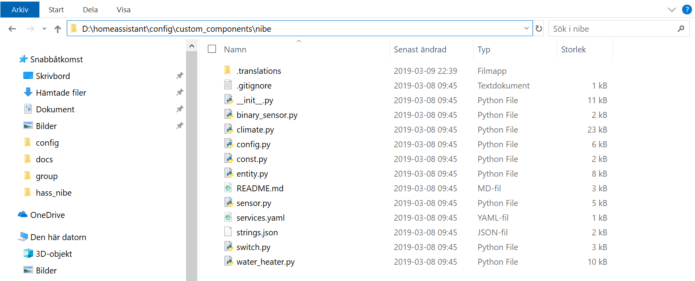

# Nibe - An home assistant plugin to get data from Nibe Uplink

## Preparation

Register an nibe uplink application on: https://api.nibeuplink.com/ and take note of the **Identifer** and the **Secret**

- If the My integration is enabled on your instance, set the redirct url to:
  - `https://my.home-assistant.io/redirect/oauth`

- If the My integration is not enabled, it must match the hostname path of how you access home assistant.
  - `http://homeassistant.local:8123/auth/external/callback`
  - `http://localhost:8123/auth/external/callback`
  - `https://public-hostname/auth/external/callback`

## Installation

### HACS installation (Recommended)

1. Add this repository as a custom repository inside [HACS](https://hacs.xyz/) settings. Make sure you select `Integration` as Category.
2. Install the component from the Overview page.

<details>
  <summary>Click to expand alternative methods!</summary>

### Git installation (Advanced)

1. Make sure you have git installed on your machine.
2. Navigate to you home assistant configuration folder.
3. Create a `custom_components` folder of it does not exist, navigate down into it after creation.
4. Execute the following command: `git clone https://github.com/elupus/hass_nibe.git nibe`

### Manual installation (Error prone)

1. Download the zip file and extract the folder inside to your custom_components folder. Create the folder is it does not exist.
2. Rename the folder "hass_nibe-master" to "nibe". All files, including the .translation folder, should be inside the "nibe" catalog under the custom_components folder.
   

</details>

## Setup

1. Go to the Applications Credentials page and register the **Identifer** (OAuth Client ID) and **Secret** (OAuth Client Secret) for the `Nibe Uplink Heat Pumps`

    [](https://my.home-assistant.io/redirect/application_credentials/)

2. Go to the Integrations page located in Home Assistants Configuration dashboard and add the integration `Nibe Uplink Heat Pumps`.

    [](https://my.home-assistant.io/redirect/config_flow_start/?domain=nibe)

3. Your browser will open a new window/tab directed at nibeuplink:s home page. After logging in and accepting access for this client id, the window will close and you will be back in home assistant.

## Configuration

Full configuration description

```yaml
nibe:
  systems:
    # System identifier to add extra entities too
    - system: <system identifier>

      # Optional list of additional parameters to retrieve, can be done here or on the sensor platform.
      sensors:
        - <parameter identifier>
        - <parameter identifier>

      # Optional list of switches (note, for ability to change, you need to use writeaccess and have payed license).
      switches:
        - hot_water_boost

      # Optional smart thermostats.
      thermostats:
        # Key in dict is external identifer in nibe uplink, it should
        # be an unique integer for this thermostat
        1:
          # Required friendly name of thermostat
          name: 'Kitchen Thermostat'

          # Optional name of a home assistant entity representing current temperature
          current_temperature: input_number.current

          # Optional name of a home assistant entity representing valve position of
          # a thermostat. At the moment it's use case is unknown.
          # valve_position: input_number.valve

          # List of systems that this thermostat is affecting. This is
          # this is the sub climate system/area index (System 1, System 2, ..)
          # that the pump is controlling.
          systems: 1

        2:
          name: 'Livingroom Thermostat'
          current_temperature: input_number.current
          systems: 1
```
